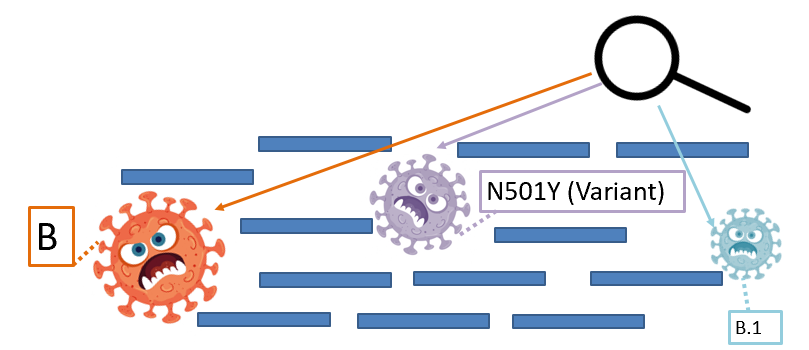

# VirStrain   
An RNA virus strain-level identification tool for short reads.


### E-mail: heruiliao2-c@my.cityu.edu.hk
### Version: V1.1 
---------------------------------------------------------------------------
### Dependencies:
* Python >=3.6 (3.6 is recommanded and 3.9 is not supprted now!)
* Perl
* Required python package: networkx==2.4, numpy==1.17.3, pandas==1.0.1, biopython==1.74, Plotly==3.10.0

(If you have installed conda, then you can run `sh install_package.sh` to install all required packages automatically.)

Make sure these programs have been installed before using VirStrain.

## Install (Linux or ubuntu only)

####
`git clone https://github.com/liaoherui/VirStrain.git`<BR/>
`cd VirStrain`<BR/>
`chmod 755 bin/jellyfish-linux`<BR/>
`rm VirStrain_DB.tar.gz`<BR/>
####

Then, you can download the reference database of 3 RNA viruses. 
There are three ways to download the reference database.<BR/><BR/>
-> Method-1:<BR/>
Run:<BR/>
`cd VirStrain`<BR/>
`sh download.sh`<BR/> <BR/>
-> Method-2:<BR/>
Run:<BR/>
`cd VirStrain`<BR/>
`wget https://github.com/liaoherui/VirStrain/raw/main/VirStrain_DB.tar.gz`<BR/>
`tar -zxvf VirStrain_DB.tar.gz`<BR/>
`rm VirStrain_DB.tar.gz` <BR/> <BR/>
-> Method-3:<BR/>
If you have installed `git lfs`, then you can simply run: <BR/>
`git lfs clone https://github.com/liaoherui/VirStrain.git`<BR/>
Then the database will be cloned with the repository. Then, run: <BR/>
`cd VirStrain`<BR/>
`tar -zxvf VirStrain_DB.tar.gz`<BR/>
`rm VirStrain_DB.tar.gz` <BR/>

If all failed, please email to the author to get the database.

You can also build the VirStrain database with your own genomes, the mannual is written in Usage section.

## Usage

### Use VirStrain to identify RNA virus strains in short reads.

For SE reads:<BR/>
  `python VirStrain.py -i Test_Data/MT451123_1.fq -d VirStrain_DB/SCOV2 -o MT451123_SE_Test`<BR/>

For PE reads:<BR/>
  `python VirStrain.py -i Test_Data/MT451123_1.fq -p Test_Data/MT451123_2.fq -d VirStrain_DB/SCOV2 -o MT451123_PE_Test`<BR/>

When the virus has high mutation rate, like HIV, you may need to add `-m` parameter.

For HIV:<BR/>
  SE reads: `python VirStrain.py -i <Read1> -d VirStrain_DB/HIV -o <Output_dir> -m`<BR/>
  PE reads: `python VirStrain.py -i <Read1> -p <Read2> -d VirStrain_DB/HIV -o <Output_dir> -m`<BR/>

### Use VirStrain to build your own custom database.<BR/>
  `python VirStrain_build.py -i <Input_MSA> -d <Database_Dir>`<BR/>
  
  For small-scale strains (<100), you can use manual-covering function to cover more useful sites.
  
  `python VirStrain_build.py -i <Input_MSA> -d <Database_Dir> -s 1`<BR/>
  
  Besides, if you only want to use SNV sites from "x" to "y" (eg. x=500 to y=1000), then you can add the parameter `-r`.
  
  `python VirStrain_build.py -i <Input_MSA> -d <Database_Dir> -s 1 -r 500-1000`<BR/>
  
  Note: The format of input MSA should be same as the format of MSA generated by Mafft (https://mafft.cbrc.jp/alignment/software/).<BR/>
  
### Full command-line options
<!---(Note: The initial idea of development of VirStrain is "Simpler is better". We do not want to burden users due to complicated usage of VirStrain. So the default parameters (some are inside the program) are simple but have good performance in our test, however, more useful parameters will be added for users who need them.)-->

Identification - VirStrain.py (Default k-mer size: 25)
```
VirStrain - An RNA virus strain-level identification tool for short reads.

Example: python VirStrain.py -i Test_Data/MT451123_1.fq -p Test_Data/MT451123_2.fq -d VirStrain_DB/SCOV2 -o MT451123_PE_Test

required arguments:
    -i, --input_reads             Input fastq data.
    -d, --database_dir            Path of VirStrain database.

optional arguments:
    -h, --help                    Show help message and exit.
    -o, --output_dir              The output directory. (Default: ./VirStrain_Out)
    -p, --input_reads2            Input fastq data for PE reads
    -c, --site_filter_cutoff      The cutoff of filtering one site when calculate the Vscore. (Default: 0.05)
    -m, --high_mutation_virus     If the virus has high mutation rate (like HIV), use this option. (Default: off)
```
Build database - VirStrain_build.py (Default k-mer size: 25)
```
VirStrain - An RNA virus strain-level identification tool for short reads.

Example:  python VirStrain_build.py -i <Input_MSA> -d <Database_Dir>

required arguments:
     -i, --input_msa               Input MSA file (Must have same format to msa generated by mafft).    
optional arguments:
     -d, --database_dir            The output directory of constructed database. (Default: ./VirStrain_DB)
     -c, --dash_cutoff             The cutoff of dash in each column of MSA. (Default: 0)
     -s, --sites_cutoff            The cutoff of sites number for manual-covering function. (eg. 1 means all useful sites will be use and 0.8 means 80% useful sites will be used)
     -r, --sites_rcutoff           The cutoff of sites range for covering algorithm (eg. 3-500 means the covering algorithm will only consider the SNV sites from 3-500 of MSA.)          

```


## Output Format

The output of VirStrain contains two files. The first is a report file in text format. This file contains all identified strains and their depth and site coverage, etc. The other file is an interactive HTML page to display the depth and uniqueness of sites. 

You can check the output file in the folder "MT451123_Sim_PE" in this repository.

The picture below displays an output example of a simulated data (Truth: MT451123.1). <BR/>


Explaination about the four headers in the output of VirStrain
Header    |	Description	
------------ | ------------- 
**Most Possible strain*** | The most possible strain in the sequencing data detected by VirStrain.<BR/>(The strains with highest Vscore in the first iteraition.)
**Other Possible strains*** | The other possible strain in the sequencing data detected by VirStrain.<BR/>(The strains with highest Vscore in the later iteraition, 10 mutation number can be a strong evidence for other possible strains according to our experiment result.)
Highest Map Strains | The strain with maximum "Covered SNV site/Total SNV site" in the first iteration. For user's reference.
Top 10 Score Strains | The top10 strain sorted by Vscore in the first iteration. <BR/>For user's reference, and also could be useful information to detect those low abundance strains which are highly similar to the high abundance strain (Eg, only one mutation number).

（Note: the header with **\*** means the content following this header includes the main identification result.）

Explaination about the columns in the output of VirStrain:

Column_name    |	Description	
------------ | ------------- 
Strain_ID |	The NCBI accession number of identified strain.
Cls_info | The cluster information of identified strain, eg: Cluster2830_2 -> belong Cluster2830, size=2.
SubCls_info | The sub-cluster information of identified strain.
Vscore | The Vscore generated by VirStrain algorithm.
Valid_Map_Rate | The covered sites out of total sites in the first iteration of VirStrain.
Site_coverage | The covered sites out of total sites in the current iteration of VirStrain.
Strain_depth | The sequencing depth of identified strain predicted by VirStrain.
Strain_info | The metadata of identified strains, such as region information and subtype, etc.
SNV_freq | The SNV frequency of all sites.


