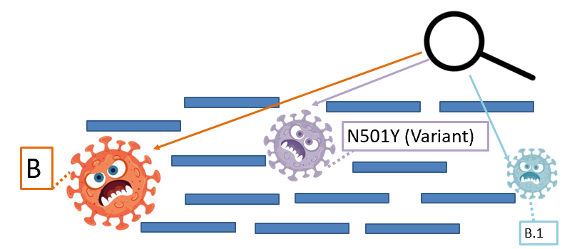

[](http://bioconda.github.io/recipes/virstrain/README.html)

# VirStrain 

**VirStrain** is an RNA virus strain-level identification tool for short-read sequencing data.

## Overview

VirStrain supports:

- Strain identification from **single-end** and **paired-end** short reads
- Strain identification from **assembled contigs**
- Construction of **custom VirStrain databases**
- Use of **pre-built public databases** for common viral species

## Contact

- **Email:** heruiliao2-c@my.cityu.edu.hk
- **Recommended version:** **v1.18**
- **Legacy note:** **v1.14** fixed some bugs, but did **not** include `virstrain_contig` or `virstrain_merge`

---

## Changelog

<details>
<summary><strong>2024 updates</strong></summary>

### 2024-05-28
- **v1.17**: Added the `-v` parameter to display version information  
  _Available in the GitHub version only_

### 2024-03-11
- **v1.17**: Synced all changes to both **GitHub** and **Conda**

### 2024-02-27
- `Tem_Vs` files are now named randomly in the **GitHub version**
- Added links for downloading **pre-built databases**

</details>

<details>
<summary><strong>2023 updates</strong></summary>

### 2023-10-12
- **v1.14**: Fixed a bug in **v1.13** related to handling gzipped FASTQ files

### 2023-09-05
- Added a new function for **contig-based viral strain identification**
- Supports comprehensive identification across **45,619 strains** from **28 viral species**

</details>

<details>
<summary><strong>2022 updates</strong></summary>

### 2022-12-20
- **v1.13**: Fixed a database generation bug present in **v1.12** of the Bioconda release

### 2022-12-16
- The VirStrain web server extension, **StrainDetect**, is now online:  
  https://strain.ee.cityu.edu.hk

### 2022-11-10
- Added parameter `-s` to sort the most likely strain by site matches

### 2022-03-23
- Fixed a Perl script bug related to header name handling

### 2022-02-08
- Added an alternative method for downloading databases from Figshare

### 2022-02-05
- **v1.12**: VirStrain can now accept **gzipped FASTQ** input files

</details>

<details>
<summary><strong>2021 updates</strong></summary>

### 2021-11
- Added downloadable databases for two DNA viruses used in the paper:
  - **HBV**
  - **HCMV**
- Added a larger **SARS-CoV-2** database  
  See Supplementary Section 1.1 of the paper

</details>

---

## Requirements

### Dependencies

- **Python** >= 3.10  
  - **Recommended:** 3.10.19  
  - **Should work on python >3.11 as well**
- **Perl**
- Python packages:
  - `networkx==3.3`
  - `numpy==1.26.4`
  - `pandas==2.3.3`
  - `biopython==1.84`
  - `plotly==6.5.0`
- **Bowtie2**  
  Required for VirStrain version **>= v1.18**

If you use Conda, you can install required packages automatically with:

```bash
sh install_package.sh
````

> If you install VirStrain via **Bioconda** or **pip**, you can ignore manual dependency installation.

---

## Installation

> Supported platform: **Linux / Ubuntu**

### Option 1: Install with Bioconda

Once Bioconda is configured:

```bash
conda install -c bioconda virstrain
```

### Option 2: Install with pip

```bash
pip install virstrain==1.18
```

### Option 3: Manual installation

Make sure all dependencies are installed first.

```bash
git clone https://github.com/liaoherui/VirStrain.git
cd VirStrain
chmod 755 bin/jellyfish-linux
rm VirStrain_DB.tar.gz
```

---

## Command mapping

If you installed VirStrain via **Bioconda** or **pip**, use the following command names:

| Source install command                  | Bioconda / pip command |
| --------------------------------------- | ---------------------- |
| `python VirStrain.py -h`                | `virstrain -h`         |
| `python VirStrain_build.py -h`          | `virstrain_build -h`   |
| `python VirStrain_contig.py -h`         | `virstrain_contig -h`  |
| `python VirStrain_contigDB_merge.py -h` | `virstrain_merge -h`   |

---

## Databases

### Download the default reference database

After cloning the repository:

```bash
cd VirStrain
sh download.sh
```

### Alternative download method

```bash
cd VirStrain
wget -qO- "https://figshare.com/ndownloader/files/34002479" | tar -zx
```

You may also download the database manually from Figshare and extract it with:

```bash
tar -zxvf <downloaded_file>
```

If all download methods fail, please contact the author by email.

### Additional downloadable databases

#### DNA virus databases

```bash
sh download_dna.sh
```

Includes databases for:

* **HBV**
* **HCMV**

#### Larger SARS-CoV-2 database

```bash
sh download_scov2_big.sh
```

#### Contig-level database

```bash
sh download_contig_db.sh
```

---

## Pre-built database downloads

If the download scripts fail, pre-built databases are also available via Google Drive.

| Name                         | Description                                                                     | Download                                                                                           |
| ---------------------------- | ------------------------------------------------------------------------------- | -------------------------------------------------------------------------------------------------- |
| `VirStrain_DB.tar.gz`        | Databases containing **SCOV2**, **H1N1**, and **HIV** strains used in the paper | [Google Drive](https://drive.google.com/file/d/1XYqr64tJec7VeDBD0Xc9cuUZqmawoty6/view?usp=sharing) |
| `SCOV2_newBig.tar.gz`        | Expanded database containing additional **SCOV2** strains                       | [Google Drive](https://drive.google.com/file/d/1qAHjVADTiV3G00YekqystUXT2e7Ho2kq/view?usp=sharing) |
| `VirStrain_DNA_DB.tar.gz`    | Databases containing **HBV** and **HCMV** strains                               | [Google Drive](https://drive.google.com/file/d/1INmaOpBKYFXj1gAngG6CikT7xVjmxsGZ/view?usp=sharing) |
| `VirStrain_contig_DB.tar.gz` | Contig-level database                                                           | [Google Drive](https://drive.google.com/file/d/1oj-86Njz5mnY6djbhdv23a9r9OH5oqog/view?usp=sharing) |

---

## Usage

> If you installed VirStrain via **Bioconda** or **pip**, replace script-based commands with the corresponding installed commands shown above.

### 1) Identify RNA virus strains from short reads

#### Single-end reads

```bash
python VirStrain.py -i Test_Data/MT451123_1.fq -d VirStrain_DB/SCOV2 -o MT451123_SE_Test
```

#### Paired-end reads

```bash
python VirStrain.py -i Test_Data/MT451123_1.fq -p Test_Data/MT451123_2.fq -d VirStrain_DB/SCOV2 -o MT451123_PE_Test
```

#### High-mutation viruses such as HIV

Use the `-m` option.

Single-end:

```bash
python VirStrain.py -i <Read1> -d VirStrain_DB/HIV -o <Output_dir> -m
```

Paired-end:

```bash
python VirStrain.py -i <Read1> -p <Read2> -d VirStrain_DB/HIV -o <Output_dir> -m
```

---

### 2) Identify viral strains from assembled contigs

```bash
python VirStrain_contig.py -i <Input_Contig_fasta> -d VirStrain_contig_DB -o VirStrain_Contig_Res
```

#### Convert read-based databases into a contig database

```bash
python VirStrain_contigDB_merge.py -i VirStrain_DB/SCOV2,VirStrain_DB/H1N1 -o VirStrain_contig_DB_merge
```

---

### 3) Build a custom VirStrain database

Basic usage:

```bash
python VirStrain_build.py -i <Input_MSA> -d <Database_Dir>
```

#### Important header naming rule

Characters `,` and `|` are **not allowed** in sequence headers in `<Input_MSA>`.

Examples:

* Not allowed: `>Strain_A, 2022`
* Not allowed: `>Strain_A|2022`
* Allowed: `>Strain_A_2022`

#### Manual covering for small datasets or large viral genomes

For small strain collections (<1000 strains) or viruses with large genomes such as **HCMV**, you can use the manual covering function with `-s` to retain more useful sites.

Example:

```bash
python VirStrain_build.py -i <Input_MSA> -d <Database_Dir> -s 0.4
```

General guidance:

* `0.2–0.6` is usually a reasonable range for `-s`
* With very few strains (for example, 3 strains), a larger value such as `-s 0.8` may also work

#### Restrict SNV site range

If you only want to use SNV sites from position `x` to `y`, use `-r`.

Example:

```bash
python VirStrain_build.py -i <Input_MSA> -d <Database_Dir> -s 0.4 -r 500-1000
```

#### Input format note

The input MSA must have the same format as an alignment generated by **MAFFT**:

[https://mafft.cbrc.jp/alignment/software/](https://mafft.cbrc.jp/alignment/software/)

---

## Full command-line options

<details>
<summary><strong>VirStrain.py — short-read strain identification</strong></summary>

**Default k-mer size:** `25`

```text
VirStrain - An RNA virus strain-level identification tool for short reads.

Example:
python VirStrain.py -i Test_Data/MT451123_1.fq -p Test_Data/MT451123_2.fq -d VirStrain_DB/SCOV2 -o MT451123_PE_Test

required arguments:
    -i, --input_reads             Input FASTQ data
    -d, --database_dir            Path to VirStrain database

optional arguments:
    -h, --help                    Show help message and exit
    -o, --output_dir              Output directory (default: ./VirStrain_Out)
    -p, --input_reads2            Input FASTQ data for paired-end reads
    -c, --site_filter_cutoff      Site filtering cutoff used when calculating Vscore (default: 0.05)
    -s, --rank_by_sites           If set to 1, sort the most likely strain by site matches (default: 0)
    -f, --turn_off_figures        If set to 1, do not generate figures (default: 0)
    -m, --high_mutation_virus     Use for high mutation rate viruses such as HIV
```

</details>

<details>
<summary><strong>VirStrain_build.py — custom database construction</strong></summary>

**Default k-mer size:** `25`

```text
VirStrain - An RNA virus strain-level identification tool for short reads.

Example:
python VirStrain_build.py -i <Input_MSA> -d <Database_Dir>

required arguments:
    -i, --input_msa               Input MSA file (must match MAFFT output format)

optional arguments:
    -d, --database_dir            Output directory for the constructed database (default: ./VirStrain_DB)
    -c, --dash_cutoff             Dash cutoff for each MSA column (default: 0)
    -s, --sites_cutoff            Cutoff for manual-covering function
                                  (e.g. 1 = all useful sites; 0.8 = 80% of useful sites)
    -r, --sites_rcutoff           Site range cutoff for covering algorithm
                                  (e.g. 3-500 means only SNV sites from positions 3 to 500 are considered)
```

</details>

---

## Output format

VirStrain generates two primary outputs:

1. A **text report**

   * Contains identified strains, depth, site coverage, and related metrics

2. An **interactive HTML report**

   * Displays depth and site uniqueness information visually

You can find an example output in the `MT451123_Sim_PE` folder in this repository.

Example report image:


### Report sections

| Header                      | Description                                                                                                                                                                                                  |
| --------------------------- | ------------------------------------------------------------------------------------------------------------------------------------------------------------------------------------------------------------ |
| **Most Possible strain***   | The most likely strain detected by VirStrain. These are the strains with the highest Vscore in the **first iteration**.                                                                                      |
| **Other Possible strains*** | Additional possible strains detected by VirStrain. These are identified in **later iterations**. Based on the authors’ experiments, **10 mutations** can be strong evidence for additional possible strains. |
| `Highest Map Strains`       | The strain with the maximum `Covered SNV site / Total SNV site` in the first iteration. Provided for reference.                                                                                              |
| `Top 10 Score Strains`      | The top 10 strains ranked by Vscore in the first iteration. This can help identify low-abundance strains highly similar to high-abundance strains.                                                           |

> Headers marked with `*` contain the main identification results.

### Report columns

| Column           | Description                                                                                                   |
| ---------------- | ------------------------------------------------------------------------------------------------------------- |
| `Strain_ID`      | NCBI accession number or other public database identifier for the identified strain                           |
| `Cls_info`       | Cluster information for the identified strain, e.g. `Cluster2830_2` means cluster `Cluster2830` with size `2` |
| `SubCls_info`    | Sub-cluster information                                                                                       |
| `Vscore`         | Score generated by the VirStrain algorithm                                                                    |
| `Total_Map_Rate` | Covered sites out of total sites in the first iteration                                                       |
| `Valid_Map_Rate` | Covered sites out of total sites in the remaining iterations                                                  |
| `Strain_depth`   | Predicted sequencing depth for the identified strain                                                          |
| `Strain_info`    | Metadata for the identified strain, such as region and subtype                                                |
| `SNV_freq`       | SNV frequency across all sites                                                                                |

---

## Citation

If you use VirStrain, please cite:

```text
Liao, H., Cai, D. & Sun, Y. VirStrain: a strain identification tool for RNA viruses. Genome Biology 23, 38 (2022). https://doi.org/10.1186/s13059-022-02609-x
```

